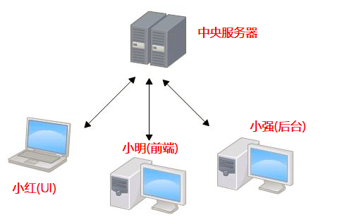
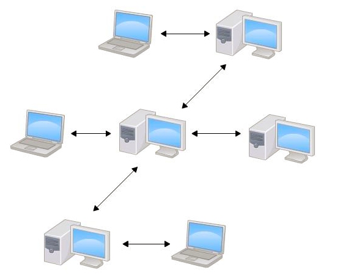
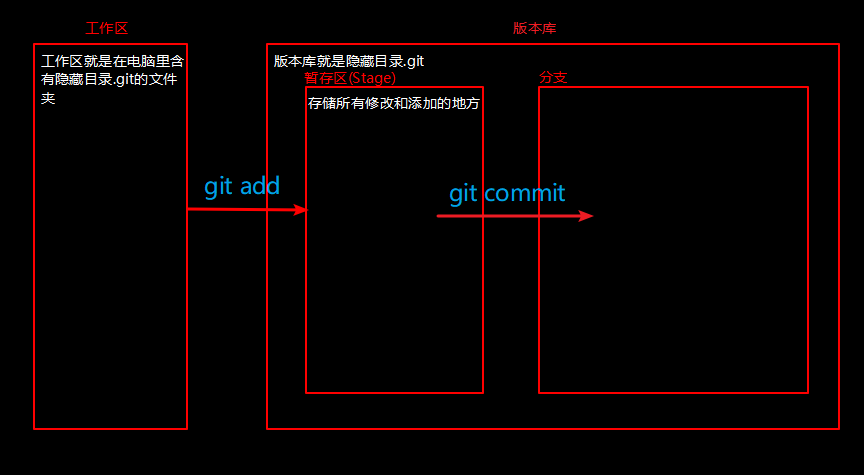
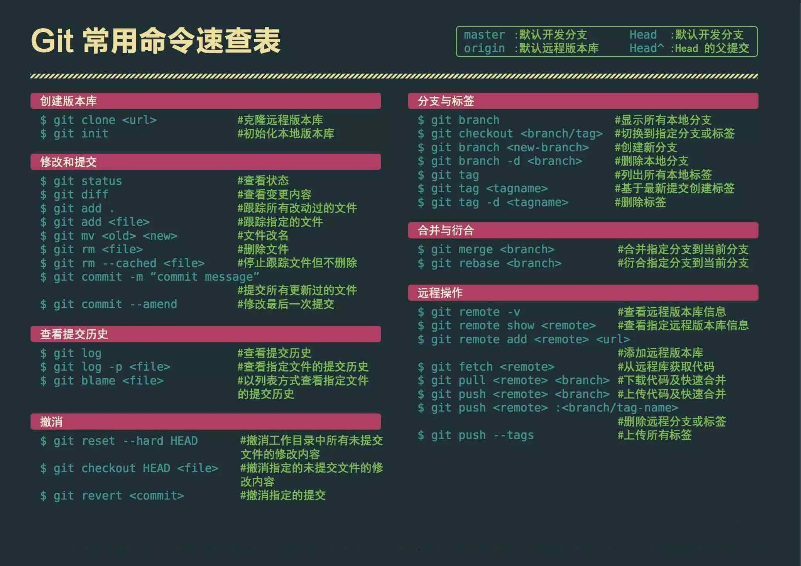

# git 基本操作

## 1、常用命令行工具
+ cmd
+ powershell
+ git bash

## 2、常用命令
- pwd (print working directory) 查看当前所在的目录
- cd (change directory) 切换目录
- ls (list) 查看当前目录下的内容
- cls 清屏--window命令工具的清屏命令
- mkdir (make directory) 创建目录
- touch 创建文件
- rm (remove) 删除文件 如 rm index.html、rm -rf blog
- rmdir (remove directory) 删除文件夹 只能删除空文件夹 不常用
- mv (move) 移动文件或重命名
- cp (copy) 复制文件
- echo '内容' > 文件 输出内容到文件 每次输出都是覆盖原有文件内容
- ehco '内容' >> 文件 输出内容到文件 每次输出都是追新内容
- 命令的基本组成部分
    + rm(删除命令) -rf(选项)

## 3、Git是什么?   VCS version(版本) control(控制)  system(系统)

  Git是目前世界上最先进的分布式版本控制系统（没有之一）。Git有什么特点？简单来说就是：高端大气上档次！

## 4、为什么要使用Git

  想删除一个段落，又怕将来想恢复找不回来怎么办？有办法，先把当前文件“另存为……”一个新的Word文件，再接着改，改到一定程度，再“另存为……”一个新文件，这样一直改下去，最后你的Word文档变成了这样：
    readme.doc
    readme2.doc
    readme3.doc
    readme4.doc
    readme5.doc
  过了一周，你想找回被删除的文字，但是已经记不清删除前保存在哪个文件里了，只好一个一个文件去找，真麻烦。
  看着一堆乱七八糟的文件，想保留最新的一个，然后把其他的删掉，又怕哪天会用上，还不敢删，真郁闷。

  更要命的是，有些部分需要你的财务同事帮助填写，于是你把文件Copy到U盘里给她（也可能通过Email发送一份给她），然后，你继续修改Word文件。一天后，同事再把Word文件传给你，此时，你必须想想，发给她之后到你收到她的文件期间，你作了哪些改动，得把你的改动和她的部分合并，真困难。

  于是你想，如果有一个软件，不但能自动帮我记录每次文件的改动，还可以让同事协作编辑，这样就不用自己管理一堆类似的文件了，也不需要把文件传来传去。如果想查看某次改动，只需要在软件里瞄一眼就可以，岂不是很方便？

  版本	    用户	    说明	                      日期
   1        张三	    删除了软件服务条款5	        7/12 10:38
   2        张三	    增加了License人数限制	      7/12 18:09
   3	    李四	    财务部门调整了合同金额	       7/13 9:51
   4	    张三	    延长了免费升级周期	           7/14 15:17

## 5、Git的诞生

  很多人都知道，Linus在1991年创建了开源的Linux，从此，Linux系统不断发展，已经成为最大的服务器系统软件了。Linus虽然创建了Linux，但Linux的壮大是靠全世界热心的志愿者参与的，这么多人在世界各地为Linux编写代码，那Linux的代码是如何管理的呢？事实是，在2002年以前，世界各地的志愿者把源代码文件通过diff的方式发给Linus，然后由Linus本人通过手工方式合并代码！你也许会想，为什么Linus不把Linux代码放到版本控制系统里呢？不是有CVS、SVN这些免费的版本控制系统吗？因为Linus坚定地反对CVS和SVN，这些集中式的版本控制系统不但速度慢，而且必须联网才能使用。有一些商用的版本控制系统，虽然比CVS、SVN好用，但那是付费的，和Linux的开源精神不符。不过，到了2002年，Linux系统已经发展了十年了，代码库之大让Linus很难继续通过手工方式管理了，社区的弟兄们也对这种方式表达了强烈不满，于是Linus选择了一个商业的版本控制系统BitKeeper，BitKeeper的东家BitMover公司出于人道主义精神，授权Linux社区免费使用这个版本控制系统。安定团结的大好局面在2005年就被打破了，原因是Linux社区牛人聚集，不免沾染了一些梁山好汉的江湖习气。开发Samba的Andrew试图破解BitKeeper的协议（这么干的其实也不只他一个），被BitMover公司发现了（监控工作做得不错！），于是BitMover公司怒了，要收回Linux社区的免费使用权。Linus可以向BitMover公司道个歉，保证以后严格管教弟兄们，嗯，这是不可能的。实际情况是这样的：Linus花了两周时间自己用C写了一个分布式版本控制系统，这就是Git！一个月之内，Linux系统的源码已经由Git管理了！牛是怎么定义的呢？大家可以体会一下。Git迅速成为最流行的分布式版本控制系统，尤其是2008年，GitHub网站上线了，它为开源项目免费提供Git存储，无数开源项目开始迁移至GitHub，包括jQuery，PHP，Ruby等等。历史就是这么偶然，如果不是当年BitMover公司威胁Linux社区，可能现在我们就没有免费而超级好用的Git了。   Git和GitHub没关系

  世界上有很多版本控制系统  Git(分布式版本控制系统)    SVN(集中式版本控制系统)     CVS

## 6、集中式与分布式

  > 集中式版本控制系统:

    代表: CVS  SVN
    特点: 版本库集中存放在中央服务器 必须联网才能工作  如果中央服务器的代码被恶意修改了,所有人的代码都可能会有问题
          只能跟踪文本文件的改动，比如txt文件，网页，所有的程序代码等

  

  > 分布式版本控制系统:

    代表: Git
    特点: 版本库在自己的电脑上 不需要联网也能工作  安全性高 只能跟踪文本文件的改动，比如txt文件，网页，所有的程序代码等
          强烈建议使用UTF-8编码 所有语言使用同一种编码，既没有冲突，又被所有平台所支持 UTF-8是万国码--

  

## 7、安装Git

[官网下载git](https://git-scm.com/downloads)即可，在这里不累赘介绍了
[廖雪峰git安装](https://www.liaoxuefeng.com/wiki/896043488029600/896067074338496)

## 8、初始化git

  > 1. 选择一个合适的地方,创建一个空目录

    # 打开命令行工具,输入命令 代表新建了一个名字为Git的文件夹
      mkdir  Git

    # 进入Git文件夹中
      cd Git

    # 查看该文件夹的绝对位置(在windows中) **如果看到输入的pwd中有中文 请确保你的路径中没有中文**
      pwd

  > 2. 把刚才创建的文件夹目录变成Git可以管理的仓库

    # 初始化仓库
      git init

    # 如果你的文件夹中没有任何内容将会得到如下输出结果 代表是初始化了一个空的Git仓库
      Initialized empty Git repository in G:/Git/.git/

## 9、版本回退

  > 1.创建一个文件,并把该文件提交修改到Git版本库

    # 把要提交的文件添加到版本库
      git add 文件名

    # 把要提交的文件提交到版本库
      git commit -m  "本次提交的说明" 

  > 2.查看提交的日志记录

    # 查看我们提交的历史记录
      git log  或 git log --pretty=oneline

  > 3.版本回退

    # 把版本回退到前面的版本 当前版本 HEAD 上一个版本HEAD^  往上100个版本 HEAD~100
      git reset --hard HEAD^

  > 4.查看自己的每一次命令的记录

    # 如果回退到某一个版本之后又后悔了,那么可以再回到某一次提交,这时可以查看自己的写过的命令
      git reflog

  > 5.回到某一次的提交

    # 回到某一次提交就要找到某一次提交的id ,使用fit reflog可以查看自己的命令id
      git reset --hard id号

## 10、工作区和暂存区

  > 名词解释

    1.工作区(Working Directory)
      就是你在电脑里能看到的目录,比如我的GitHub文件夹目录
    2.版本库(Repository)
      在工作区有一个隐藏目录.git,这个就是Git的版本库
    3.暂存区
      在版本库中存在一个成为Stage的暂存区,它是专门存储修改和添加的区域
      一旦提交后,如果你又没有对工作区做任何修改,那么暂存区就是干净的

    4.HEAD 其实是一个指针(C系列语言中 快)
  

## 11、管理修改

为什么Git比其他版本控制系统设计得优秀，因为Git跟踪并管理的是修改，而非文件。你会问，什么是修改？比如你新增了一行，这就是一个修改，删除了一行，也是一个修改，更改了某些字符，也是一个修改，删了一些又加了一些，也是一个修改，甚至创建一个新文件，也算一个修改。
  > Git不会提交没有放到暂存区的修改

## 12、撤销修改

  什么时候会用到撤销修改呢？
    1.当你使用了 git commit 之后 是无法撤销的
    2. 在你没有git add 之前(在工作区)  没有被历史所记录 直接删除掉或者使用git checkout --file
    3. 没有git commit 之前可以撤销(文件在暂存区 但不在历史记录区)
        用已经提交的记录 git reset --hard HEAD 把暂存区的改变给冲掉(覆盖掉)

  > 1.当你改乱了工作区某个文件的内容，想直接丢弃工作区的修改时

    命令： git checkout -- file

  > 2.当你不但改乱了工作区某个文件的内容，还添加到了暂存区时，想丢弃修改

      1. git reset HEAD file
      2. git checkout -- file

## 13、删除文件

  > 1.确实要删除

    git rm 把文件删掉

    git commit 提交

  > 2.删错了

    git checkout -- files

  注意:命令git rm用于删除一个文件。如果一个文件已经被提交到版本库，那么你永远不用担心误删，但是要小心，你只能恢复文件到最新版本，你会丢失最近一次提交后你修改的内容

## 14、添加远程库

    远程库都是远程(github gitee  gitlab)添加的

    github(世界)  

    gitee(中国的) 免费的  中文  可以创建公开库 也可以创建私有库  因为和github完全的一样

    1.联网
    2.要有一个github账号

## 15、从远程库克隆

  git clone

  写代码 

  git pull

  git add

  git commit -m ""

    header  
    body
    footer
    http://www.ruanyifeng.com/blog/2016/01/commit_message_change_log.html
  git push

## 16、创建与合并分支

  分支就是科幻电影里面的平行宇宙，当你正在电脑前努力学习Git的时候，另一个你正在另一个平行宇宙里努力学习SVN。如果两个平行宇宙互不干扰，那对现在的你也没啥影响。不过，在某个时间点，两个平行宇宙合并了，结果，你既学会了Git又学会了SVN！

  分支在实际中有什么用呢？假设你准备开发一个新功能，但是需要两周才能完成，第一周你写了50%的代码，如果立刻提交，由于代码还没写完，不完整的代码库会导致别人不能干活了。如果等代码全部写完再一次提交，又存在丢失每天进度的巨大风险。

  现在有了分支，就不用怕了。你创建了一个属于你自己的分支，别人看不到，还继续在原来的分支上正常工作，而你在自己的分支上干活，想提交就提交，直到开发完毕后，再一次性合并到原来的分支上，这样，既安全，又不影响别人工作。

  开发京东网站的过程:
      开发的    开发 不能在主分支上开发  要把开发和线上要分开  就要用到分支了  创建一个dev分支  也叫开发分支
      测试的     测试  也不能在主分支上测试  要把测试的代码和线上代码分开   这时候 也要用到分支  创建一个分支  叫测试分支

        有主管 
      一定要保证 线上的京东的稳定 --把经过测试和运行的代码 放在 主分支 master

      主分支不需要创建 因为git已经帮我们创建好了

  > 1.查看分支

    git branch

  > 2.创建分支

    git branch 分支名字

  > 3.切换分支

    git checkout 分支名字

  > 4.合并某分支到当前分支

    git merge 分支名字

  > 5.删除分支

    git branch -d 分支名字

    1. 在master 分支上 创建一个文件 word.txt
    2. 在word.txt中添加一行内容 --- 文字
    3. 把word.txt添加到暂存区 然后把word.txt提交到历史记录中
    4. 创建一个分支(git branch  分支名字)  相当于有另外一个人和你一起在维护word.txt
    5. 另外一个人就从主分支上拿到了word.txt  拿到的时候你已经工作了一段时间了 所以有内容 -- 文字
    6. 顺着你的工作进度接着工作啊  在word.txt中添加自己的工作内容
    7. 工作完成之后  把word.txt添加到暂存区  然后提交到历史记录
    8. 你看到了人家的提交 要合并人家的工作进度 

## 17、git 常用命令速查表
  

## 18、解决冲突

    场景: 出现冲突(代码的提交 一般是多次修改 一次提交)
    步骤:
        1.创建一个分支dev
        2.切换分支到dev
        3.在该分支下 创建一个文件 branch.txt
        4.在branch.txt中写一句话"HeLLO wolrd";
        5.在该分支下添加  在该分支下提交

        6.切换到主分支 会出现一个现象--branch.txt消失了
        7.在master分支下  新建一个同名文件(branch.txt) 
        8.在branch.txt中写一句话"helloWorld";
        9.添加 提交
        10.合并分支  然后冲突就出现了

        解决冲突: 手动解决冲突(不存在提交失败还能自动解决的冲突)
                  留下需要的删除不需要的

## 19、GitHub

    生产公钥和私钥 ssh-keygen -t rsa -C "your_email@example.com"

    为什么要生产公钥和私钥呢？ 为了提交方便

    在git bash中输入以上的代码：
      ssh-keygen -t rsa -C "your_email@example.com"
    然后: 回车到底

    然后找到公钥 地址: C:\Users\用户名\.ssh  找到带pub的 用记事本打开  全部复制

    然后打开github  找到小头像 点击 找到设置(settings)

    找到侧边栏 SSH and GPG keys 点一下

    把公钥添加到 SSH keys里的大框里区

## 20、vim

   在我们提交的时候，我们有可能会进入vim 怎么办呢？

   1. 先按键盘中的字母i
   2. 按esc
   3. 同时按住shift + :  在后面输入wq
